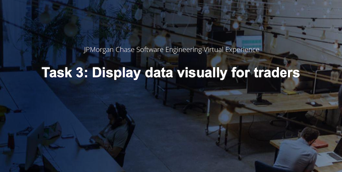
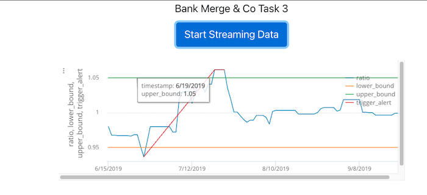
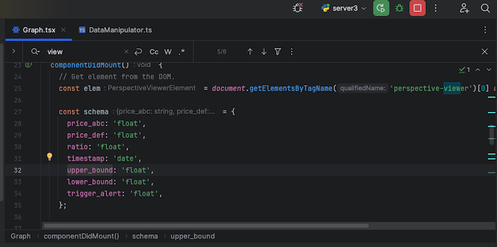
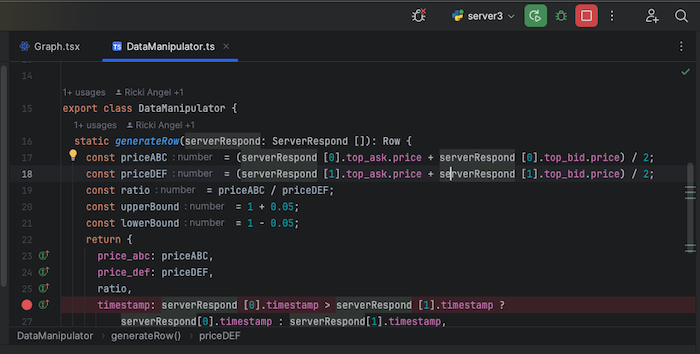

# Task 3 of the JPMorgan Chase Software Engineering program. 
This task involves updating  JPMorgan Chase’s open source library called 'Perspective' to generate a live graph that displays a data feed in a clear and visually appealing way for traders to monitor. 

Using technologies such as React+  Node.js, javascript/typescript, npm.

